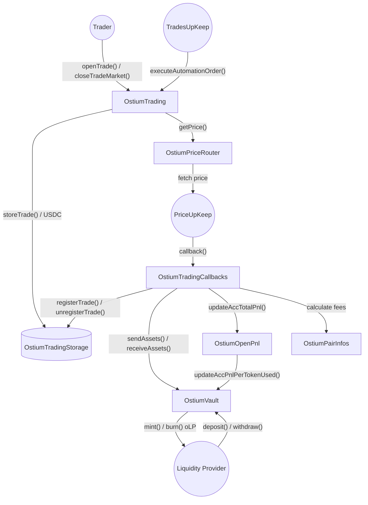
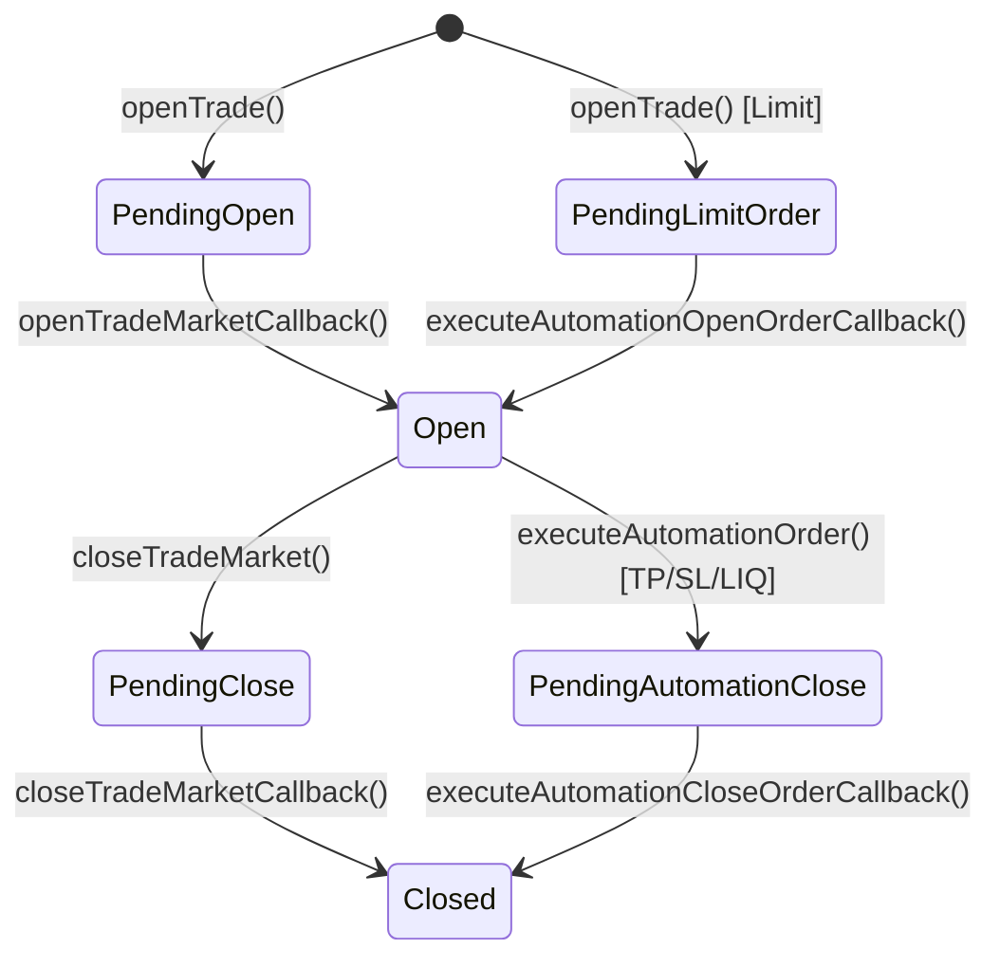

# Protocol Overview — Ostium V2

## Core Purpose

Ostium V2 is a decentralized, non-custodial perpetual trading protocol for Real World Assets (RWA) — commodities, Forex, crypto, and long-tail assets — built on top of a fork of Gains Network v5. Liquidity providers deposit USDC into a single ERC-4626 vault that acts as the counterparty to all trades.

---

## Visualizations

### 1. Architecture Diagram

### 2. Trade Lifecycle

## Actors & Roles

| Actor                       | Role                                                                                               |
| --------------------------- | -------------------------------------------------------------------------------------------------- |
| **Trader**                  | Opens/closes leveraged long or short positions; manages collateral, TP, SL                         |
| **Liquidity Provider (LP)** | Deposits USDC into the vault, receives `oLP` shares; profits from trader losses, bears trader wins |
| **Gov**                     | Protocol governance address; upgrades parameters, pauses, emergency controls                       |
| **Manager**                 | Operational role; updates OI caps, rollover fees, pair parameters                                  |
| **Builder**                 | Optional 3rd-party integrator that gets a fee cut on trades they initiate                          |
| **TradesUpKeep**            | Chainlink Keeper automation contract; triggers TP/SL/LIQ automations                               |
| **PriceUpKeep**             | Chainlink Keeper (private or public); delivers price answers back on-chain                         |
| **Dev**                     | Fee recipient (`registry.dev()`); accumulates oracle fees and opening fees                         |

---

## Contracts

| Contract                                        | Purpose                                                                                                                             |
| ----------------------------------------------- | ----------------------------------------------------------------------------------------------------------------------------------- |
| `OstiumRegistry`                                | Central address book; maps string keys → contract addresses; holds `gov`, `manager`, `dev`                                          |
| `OstiumTrading`                                 | Main user entry point; opens/closes positions and limit orders, collateral management                                               |
| `OstiumTradingCallbacks`                        | Receives fulfilled price answers; finalises trade registration and closure, handles liquidations                                    |
| `OstiumTradingStorage`                          | State database; stores open trades, limit orders, pending orders, OI, and USDC custody                                              |
| `OstiumVault`                                   | ERC-4626 LP vault (`oLP` token); manages share price, epochs, locked deposits, PnL accounting                                       |
| `OstiumOpenPnl`                                 | Tracks aggregate open PnL between epochs; triggers epoch rollover; feeds `accPnlPerTokenUsed` to vault                              |
| `OstiumPairInfos`                               | Per-pair fee engine; rollover fees (V2), funding fees (hill-function), opening fees (maker/taker), dynamic spread, liquidation math |
| `OstiumPairsStorage`                            | Pair registry; group collateral caps, leverage limits, oracle type per pair                                                         |
| `OstiumPriceRouter`                             | Dispatch layer; validates timestamp freshness then routes `getPrice()` to the correct `PriceUpKeep`                                 |
| `OstiumPriceUpKeep`                             | Public Chainlink upkeep; fetches off-chain price and delivers `PriceUpKeepAnswer` to callbacks                                      |
| `OstiumPrivatePriceUpKeep`                      | Private/premium variant of `PriceUpKeep`                                                                                            |
| `OstiumTradesUpKeep`                            | Scans open positions/limit orders and calls `executeAutomationOrder()` for TP/SL/LIQ triggers                                       |
| `OstiumVerifier`                                | Off-chain price signature verifier used by the price upkeeps                                                                        |
| `OstiumLockedDepositNft`                        | ERC-721; represents a locked LP deposit position (discount program)                                                                 |
| `OstiumTimelockOwner` / `OstiumTimelockManager` | Timelock wrappers for governance actions                                                                                            |

---

## Terminology

- **Profit and Loss (PnL)**: net unrealized and realized profits and losses across all positions
- **Take Profit (tp)**: A price level at which a trade is automatically closed to take profit.
- **Stop Loss (sl)**: A price level at which a trade is automatically closed to limit losses.
- **oLP**: ERC-20/ERC-4626 share token of the vault; value tracks `shareToAssetsPrice`.
- **Epoch**: A discrete vault accounting period. At each epoch end the vault snapshots open PnL and updates `accPnlPerTokenUsed`, which reprices `oLP`.
- **accPnlPerToken**: Running vault-level accumulated PnL per LP share (18 dec). `accPnlPerTokenUsed` is the snapshot used for pricing.
- **Rollover Fee (V2)**: Per-block holding cost charged on notional; expressed as a signed `lastLongPure` rate (longs pay / shorts receive or vice versa) plus a non-negative `brokerPremium`.
- **Funding Fee**: Per-block rate determined by a hill-function over the OI imbalance (`oiDelta`). Longs pay shorts (or vice versa); uses a spring-damper model to smooth rate transitions.
- **Dynamic Spread**: OI-weighted price impact applied at fill; shifts fill price against the trade direction.
- **Maker / Taker fee**: Opening fee model — reducing OI imbalance earns maker (lower) fee; adding imbalance pays taker (higher) fee.
- **Oracle Fee**: Flat per-pair fee charged on every market order price request; partially refunded on successful full close or timed-out close.
- **Builder Fee**: Optional integrator cut (≤ 0.5%) deducted from collateral at trade open.
- **TradeNotional / OI**: `collateral × leverage / 100`, stored in 18-dec PRECISION_18 units.
- **`liqMarginThresholdP`**: Percentage of collateral below which a trade is considered liquidated (e.g. 25 %).
- **`maxSl_P`**: Maximum stop-loss distance as % of open price (default 85 %).
- **Backdated execution guard**: Automation orders whose price timestamp predates the trade's `createdAt` are rejected.

---

## Key Invariants

- **Vault is always the counterparty**: All trader PnL flows through `sendAssets` / `receiveAssets` on the vault; no external AMM.
- **`accPnlPerToken ≤ maxAccPnlPerToken`**: The vault's accumulated PnL can never exceed rewards + 1 `PRECISION_18` unit (otherwise `NotEnoughAssets` reverts).
- **Oracle fee is always collected before a price request and refunded only on full close success**: Partial closes do _not_ receive a refund.
- **Collateral custody is always in `OstiumTradingStorage`**: Traders deposit USDC there on `openTrade`; vault funds only move via callbacks.
- **OI tracking is notional-denominated (18 dec)**: `openInterest[pair][0]` = long notional, `[1]` = short notional; both updated atomically on every `storeTrade` / `unregisterTrade`.
- **One pending automation trigger per (trader, pair, index, orderType)**: `orderTriggerBlock` prevents double-triggering.
- **Withdrawal requires a prior `makeWithdrawRequest`**: Shares are locked for 1–3 epochs depending on collateralization.
- **Epoch cannot start while `nextEpochValuesRequestCount > 0`**: Withdrawals are blocked during the open-PnL sampling window.
- **`isPaused` blocks new opens but not closes or limit cancellations**.
- **`isDone` blocks all interactions** (emergency brake).

---

## Main Assets

- **USDC** (6 dec) — sole collateral asset; lives in `OstiumTradingStorage` during open trades, flows to/from the vault on PnL settlement.
- **`oLP`** (6 dec, ERC-4626) — LP share token minted/burned by the vault; price = `shareToAssetsPrice / 1e18`.
- **`devFees`** (USDC in `OstiumTradingStorage`) — accumulated opening + oracle fees claimable by the dev address.
- **Locked Deposit NFT** (ERC-721) — represents a locked LP deposit earning a collateralization discount; burned on `unlockDeposit`.

---

## Happy Paths

**Main assets: `USDC`, `oLP`, `devFees`, `openInterest`, `oiNotional`**

### Path 1 — Market Open (Trader opens a position)

1.1. Trader → `OstiumTrading.openTrade()`: validates params, pulls `collateral` USDC into `TradingStorage`, calls `PriceRouter.getPrice()` → emits orderId.
1.2. `PriceUpKeep` (off-chain) → delivers signed price → `OstiumTradingCallbacks.openTradeMarketCallback()`: computes dynamic spread, checks slippage.
1.3. Callbacks → `registerTrade()`: deducts opening fee (dev + vault split), oracle fee, optional builder fee from `collateral`; stores trade in `TradingStorage`; updates `openInterest`; snapshots initial acc fees in `PairInfos`; notifies `OpenPnl.updateAccTotalPnl()`.

### Path 2 — Market Close (Trader closes a position)

2.1. Trader → `OstiumTrading.closeTradeMarket()`: validates trade exists and no pending trigger; charges oracle fee upfront; stores `PendingMarketOrderV2`; calls `PriceRouter.getPrice()`.
2.2. `PriceUpKeep` → `OstiumTradingCallbacks.closeTradeMarketCallback()`: computes PnL using rollover + funding fees, dynamic spread; calls `unregisterTrade()`.
2.3. `unregisterTrade()`: reduces `openInterest`; if trader wins → `Vault.sendAssets()` covers the surplus → USDC sent to trader; if trader loses → surplus USDC sent to `Vault.receiveAssets()`; updates `OpenPnl.updateAccTotalPnl()`.
2.4. On full close success: oracle fee refunded from `devFees` back to trader.

### Path 3 — Limit Order (Trader sets price trigger)

3.1. Trader → `OstiumTrading.openTrade()` (with `orderType ≠ MARKET`): USDC locked in storage; `OpenLimitOrder` stored.
3.2. `OstiumTradesUpKeep` (automation) → `OstiumTrading.executeAutomationOrder()`: validates price timestamp not backdated, no pending trigger; calls `PriceRouter.getPrice()`.
3.3. `PriceUpKeep` → `OstiumTradingCallbacks.executeAutomationOpenOrderCallback()`: checks fill conditions; if met → calls `registerTrade()` (same as Path 1 step 1.3); removes limit order.

### Path 4 — Automation Close (TP / SL / Liquidation)

4.1. `OstiumTradesUpKeep` → `OstiumTrading.executeAutomationOrder()` (orderType = TP | SL | LIQ): validates trade exists, not backdated, SL/TP not stale; sets trigger, calls `PriceRouter.getPrice()`.
4.2. `PriceUpKeep` → `OstiumTradingCallbacks.executeAutomationCloseOrderCallback()`: determines if LIQ/SL uses market price or TP uses fill price; recalculates PnL with all fees; closes trade same as Path 2 step 2.3.

### Path 5 — LP Deposit & Withdrawal

5.1. LP → `OstiumVault.deposit()` / `mint()`: USDC transferred to vault; `oLP` shares minted; `scaleVariables()` adjusts `accPnlPerToken` to prevent dilution.
5.2. LP → `OstiumVault.makeWithdrawRequest()`: queues share amount for `currentEpoch + withdrawEpochsTimelock()` (1–3 epochs based on collateralization ratio).
5.3. (Epoch rolls) `OstiumOpenPnl.newOpenPnlRequestOrEpoch()` / `forceNewEpoch()`: samples open PnL N times → averages → calls `Vault.updateAccPnlPerTokenUsed()` → increments epoch, reprices `oLP`.
5.4. LP → `OstiumVault.redeem()` / `redeemWithSlippage()`: removes queued shares; USDC returned at current `shareToAssetsPrice`; supply scaled down.

### Path 6 — Locked Discount Deposit (orthogonal to Path 5)

6.1. LP → `OstiumVault.depositWithDiscountAndLock()`: deposits fewer USDC than the credited `simulatedAssets` (discount based on lock duration and collateralization); `LockedDepositNft` minted; shares held by vault.
6.2. After `lockDuration` elapses, LP → `OstiumVault.unlockDeposit()`: increases `accPnlPerToken` (simulate discount cost to vault), burns NFT, transfers shares to receiver.

### Path 7 — Collateral Management (orthogonal)

- Trader → `OstiumTrading.topUpCollateral()`: pulls extra USDC, recalculates leverage down, updates group collateral.
- Trader → `OstiumTrading.removeCollateral()`: async (price required); sets trigger, charges oracle fee → callback validates not near liquidation → returns USDC and reduces leverage.

---

## External Dependencies

| Dependency                               | Type                              | Critical Assumption                                                                               |
| ---------------------------------------- | --------------------------------- | ------------------------------------------------------------------------------------------------- |
| **Chainlink Automation** (`PriceUpKeep`) | Price oracle + keeper             | Price answers are signed off-chain by a trusted verifier address; compromise = price manipulation |
| **OstiumVerifier**                       | Signature verifier for price data | Must remain uncompromised; signs `(orderId, price, bid, ask, timestamp)` tuples                   |
| **USDC (ERC-20)**                        | Collateral token                  | Assumed non-rebasing, standard ERC-20; no fee-on-transfer                                         |
| **OpenZeppelin upgradeable proxies**     | Proxy pattern (UUPS/Transparent)  | `_disableInitializers()` in constructors prevents re-initialization attacks                       |
| **Chainlink TradesUpKeep**               | Automation bot                    | Must run reliably; if down, TP/SL/LIQ orders won't fire (stuck positions)                         |
| **`registry.getContractAddress()`**      | On-chain address routing          | Gov-controlled; a malicious registry update can re-route all fund flows                           |
