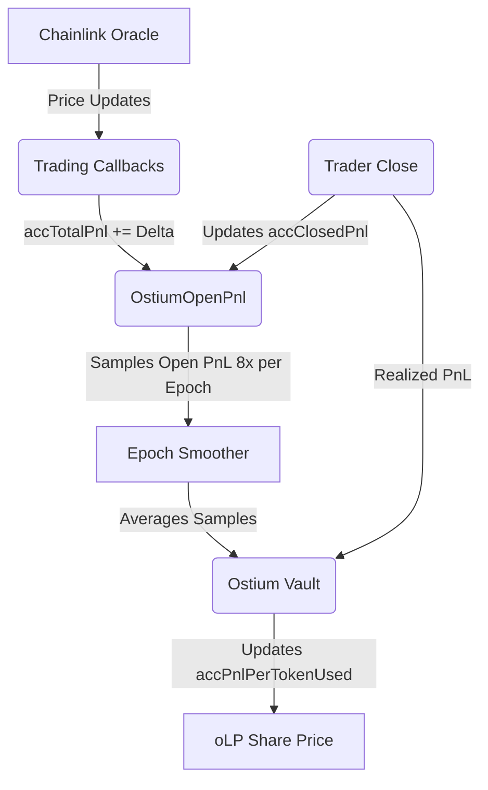

# Profit and Loss (PnL) Modeling in Ostium V2

In Ostium V2, PnL is tracked at two distinct levels to ensure solvency and accurately price Liquidity Provider (LP) shares (`oLP`):
1. **Trade-Level (Realized PnL)**: Settled individually when a trader closes a position.
2. **Vault-Level (Unrealized/Open PnL)**: Monitored globally across all open positions to continuously reprice LP shares to reflect current market exposure.

---

## 1. Trade-Level PnL (Realized)

When a trader opens a position, they lock `USDC` collateral. When the position is closed (either manually or via an automation trigger like Take Profit/Stop Loss/Liquidation), the PnL is finalized in `OstiumTradingCallbacks.sol`.

### How it is calculated:
The gross PnL is simply the difference between the close price and open price, multiplied by the position size (notional). However, the net PnL also factors in borrowing costs and spread:
```math
Net PnL = Gross PnL - (Rollover Fees + Funding Fees + Closing Fee)
```
- **Rollover Fees**: A time-based fee for borrowing liquidity from the vault.
- **Funding Fees**: A continuous rate paid between longs and shorts depending on the Open Interest (OI) imbalance.

### How it is settled:
Because the Vault is the sole counterparty to all trades:
- **Trader Wins (Positive PnL)**: The Vault sends USDC to the trader to cover the profit (`Vault.sendAssets()`).
- **Trader Loses (Negative PnL)**: The trader's lost collateral is sent to the Vault (`Vault.receiveAssets()`), padding the LP pool.

---

## 2. Vault-Level PnL (Unrealized)

Because LP shares (`oLP`) can be minted and burned at any time, the Vault must know the aggregate *unrealized* PnL of all active traders to price `oLP` fairly. If traders are currently in profit, the Vault has a latent liability, so the value of `oLP` must drop proportionally. 

Ostium tracks this using the `OstiumOpenPnl.sol` contract.

### The Accounting Model
Instead of looping over thousands of open trades to calculate current PnL (which is impossible on-chain due to gas limits), Ostium maintains incremental running totals:

- `accTotalPnl`: The running total of *all* PnL (realized + unrealized).
- `accClosedPnl`: The running total of only *realized* (closed) PnL.
- `accNetOiUnits`: The net open interest for a pair (Long Notional - Short Notional).

The current global Unrealized (Open) PnL is simply:
```solidity
Open PnL = accTotalPnl - accClosedPnl
```

### How `accTotalPnl` is Updated
Every time an oracle price arrives for *any* action on a trading pair (open, close, limit order), the `updateAccTotalPnl` function is triggered. It updates `accTotalPnl` based on the price movement since the *last* time that pair's price was updated:

```solidity
accTotalPnl += (oraclePrice - lastTradePrice) * accNetOiUnits
```
This formula incrementally adjusts the global PnL by multiplying the recent price delta by the net open interest of that pair.

---

## 3. Epochs and Smoothing (Modeling PnL)

Cryptocurrency and RWA prices can be highly volatile. If the Vault repriced `oLP` on every single oracle tick, malicious actors could sandwich trades or manipulate oracle prices to extract value via flash deposits/withdrawals.

To protect the Vault, Ostium uses an **Epoch and Smoothing** system:

1. **Sampling**: `OstiumOpenPnl` periodically samples the current `Open PnL` (e.g., 8 times over a 24-hour period).
2. **Averaging**: At the end of the epoch, it takes the **average** of these samples.
3. **Updating the Vault**: It passes this smoothed average to the Vault via `updateAccPnlPerTokenUsed()`.

### The Impact on LP Shares
The Vault tracks `accPnlPerTokenUsed`, which represents the accumulated trader PnL per `oLP` share.

```math
shareToAssetsPrice = 1 USDC - accPnlPerTokenUsed + accumulatedVaultRewards
```

If traders are highly profitable on average over an epoch, `accPnlPerTokenUsed` increases, and the `shareToAssetsPrice` drops (meaning LP shares are worth less USDC). If traders lose money, the Vault absorbs the collateral, and the `shareToAssetsPrice` goes up.

### Summary Visualization


