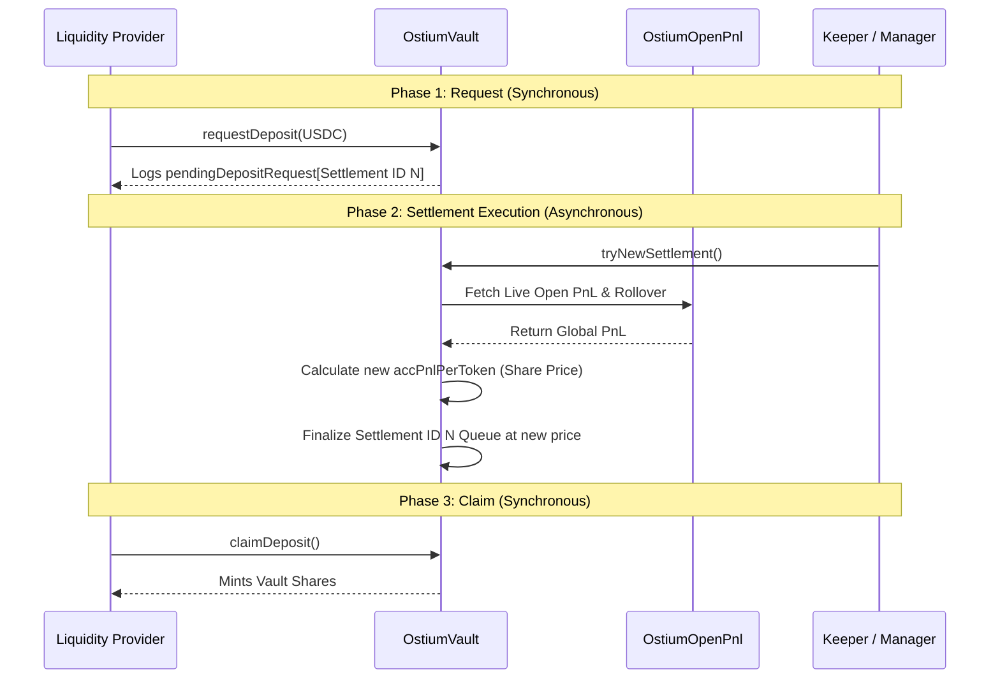

# Ostium Vault Overview

## Core Purpose

In standard DeFi lending protocols, Liquidity Providers (LPs) deposit assets and receive shares instantly based on the current exchange rate. In a synthetic leverage trading protocol like Ostium, the Vault acts as the counterparty ("the house") to all traders. If traders win, the Vault loses money; if traders lose, the Vault wins money.

**The Problem:** If LPs could deposit and withdraw instantly, they could monitor the live market and withdraw their liquidity exactly right before traders close massive winning positions, forcing remaining LPs to tank the losses (toxic flow front-running).

**The Solution:** The Ostium Vault decouples the deposit/withdraw process using an **Asynchronous Settlement Queue**. LPs submit a request to deposit/withdraw, which places them in a "Waiting Room" assigned to a future Settlement ID. A Keeper periodically executes the settlement, fetching the _exact global Profit & Loss (PnL) of all traders_ at that exact moment to calculate a fair, un-frontrunnable share price, and then finalizes the queue.

## Visualizations

### 1. Architecture Diagram

```mermaid
graph TD
    ((LP)) -->|"requestDeposit()"| [OstiumVault]
    ((LP)) -->|"requestWithdraw()"| [OstiumVault]

    [OstiumVault] -->|"getOpenPnlWithRollover()"| [(OstiumOpenPnl)]
    [(OstiumOpenPnl)] -.->|"Live PnL Data"| [OstiumVault]

    ((Keeper)) -->|"tryNewSettlement()"| [OstiumVault]
```

### 2. Execution Model (Settlement Lifecycle)



## Actors & Roles

| Actor | Role |
| --- | --- |
| **Liquidity Provider (LP)** | Deposits USDC to provide trading liquidity. Earns trading fees and trader losses; pays out trader wins. |
| **Keeper / Manager** | Periodically calls `tryNewSettlement()` to finalize pending queues and update the Vault's share price. |
| **Governance** | Configures supply caps, maximum PnL delta limits, and discount metrics. |

## Contracts

| Contract | Purpose |
| --- | --- |
| `OstiumVault` | An ERC4626-compliant vault managing asynchronous deposits, withdrawals, and PnL impact integration. |
| `OstiumOpenPnl` | Highly optimized$O(1)$ accumulator that tracks the global unrealized Profit/Loss of all active traders to accurately price the Vault. |

## Terminology

- **Settlement ID**: A sequential epoch counter. Deposit/Withdraw requests are assigned to a future settlement ID rather than executing immediately.
- **accPnlPerToken**: The master internal accumulator combining both Open (live) PnL and Closed (realized) PnL per vault share. It dictates the true exchange rate of Shares to USDC.
- **Open PnL**: The aggregate, system-wide unrealized profit or loss of all open trades. Sourced dynamically during settlement to ensure LPs cannot exit at an artificially inflated price when traders are heavily in profit.
- **Locked Deposits**: A mechanism where LPs can lock their deposit for a duration in exchange for a discount or bonus.

## Key Invariants

- **No Instant Execution**: Users can NEVER deposit or withdraw assets at the current block's `shareToAssetsPrice`. All requests must pass through the asynchronous settlement queue.
- **PnL Accuracy**: The `lastSettlementOpenPnl` must exactly mirror the global platform unrealized PnL at the block the settlement is executed to prevent value leakage.
- **Supply Caps**: Total assets managed by the Vault cannot exceed the governance-defined `supplyCap`.

## Main Assets

- `USDC` — The underlying asset deposited by LPs and used for trader payouts.
- `Vault Shares` (ERC20) — The receipt tokens minted to LPs representing their fractional ownership of the Vault pool.

## Happy Paths

### Path 1 — Async Deposit

1.1. LP → `OstiumVault.requestDeposit()`: Transfers USDC to the vault and logs a pending request for Settlement $N$. 1.2. Keeper → `OstiumVault.tryNewSettlement()`: Updates the vault's share price using live PnL and finalizes Settlement $N$. 1.3. LP → `OstiumVault.claimDeposit()`: Mints Vault Shares based on the finalized price.

### Path 2 — Async Withdraw

2.1. LP → `OstiumVault.requestWithdraw()`: Logs a pending request to burn shares for Settlement $N$ (or $N + Delay$). 2.2. Keeper → `OstiumVault.tryNewSettlement()`: Updates the vault's share price using live PnL and finalizes Settlement $N$. 2.3. LP → `OstiumVault.claimWithdraw()`: Burns Vault shares and transfers USDC to the LP.

## External Dependencies

| Dependency | Type | Critical Assumption |
| --- | --- | --- |
| `USDC` | ERC20 Token | Functions as a standard 6-decimal stablecoin (no fee-on-transfer, rebasing, or malicious blacklisting during core operations). |
| `OstiumOpenPnl` | Internal Oracle | The global Open PnL math remains uncorrupted and impossible to manipulate by isolated flash loans or price oracle attacks. |
