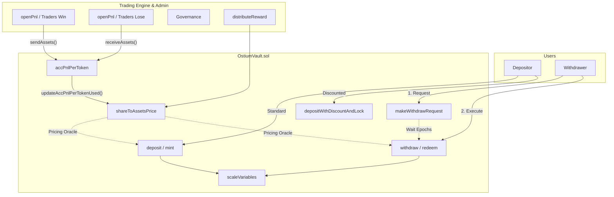
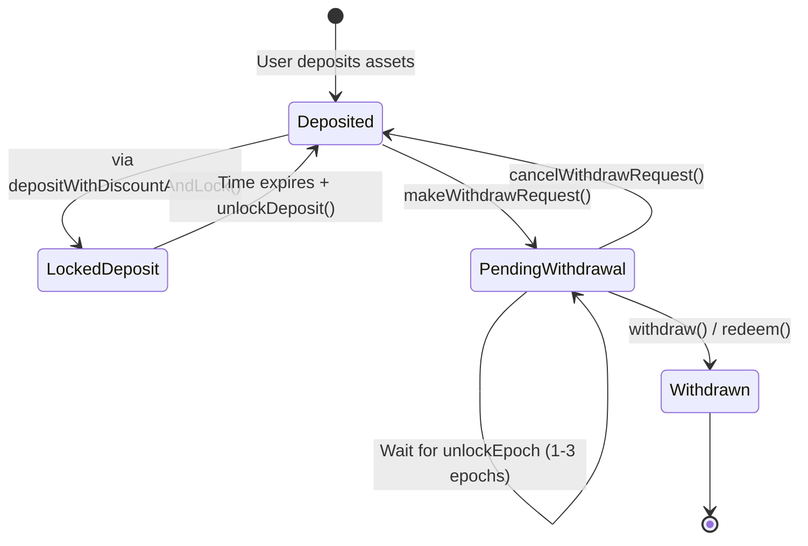

# Ostium Vault Overview & State Compression

This document combines the `protocol-overview` and `compress-states` analysis specifically for `OstiumVault.sol`, generating a deep architectural and state-level mental model for auditors.

---

## 1. Protocol Overview

### Core Purpose
`OstiumVault.sol` is a highly customized, ERC4626-compliant liquidity vault that acts as the counterparty to all trades on the Ostium protocol. It implements a unique epoch-based withdrawal queue, dynamically caps share prices to handle trading PnL via overcollateralization, and offers discounted "locked" deposit NFTs to incentivize long-term liquidity.

### Visualizations

#### Architecture & Data Flow

#### Withdrawal Lifecycle State Machine

### Actors & Roles

| Actor | Role |
| ----- | ---- |
| **Depositor / LP** | Supplies underlying assets to earn trading fees/rewards. Can deposit normally or use time-locked deposits for a discount. |
| **Withdrawer** | Must request withdrawals and wait epochs based on vault collateralization. |
| **Governance (`registry.gov()`)** | Configures risk parameters (max supply increase, max PnL delta, discount rates, lock thresholds). |
| **Callbacks (`callbacks`)** | Automated contracts that trigger `sendAssets()` when the vault loses to a trader. |
| **OpenPnl (`openPnl`)** | Orchestrates epoch rollovers and syncs `accPnlPerTokenUsed`. |
| **Anyone** | Can donate assets to the vault via `receiveAssets()` or `distributeReward()`. |

### Terminology

- **`accPnlPerToken`**: Tracks the absolute missing/excess assets per share. **Negative (< 0) means the vault is in profit (overcollateralized)**. Positive (> 0) means the vault is in loss.
- **Epoch**: A dynamic time window (usually updated via OpenPnl) used to queue withdrawals. 
- **Locked Deposit**: A deposit minted with a discount, requiring the user to hold an NFT receipt and wait out a `lockDuration` before unlocking shares.
- **`shareToAssetsPrice`**: The internal pricing oracle. It is capped at `maxAccPnlPerToken()`—meaning trading profits do *not* increase the share price, they act as an overcollateralization buffer.

### Key Invariants

1. **Share Price Cap**: `shareToAssetsPrice` can never exceed `maxAccPnlPerToken()` (Base 1e18 + Rewards). Trading profits act purely as overcollateralization.
2. **Withdrawal Queue**: A user can never withdraw more shares than `withdrawRequests[user][currentEpoch]`. `maxWithdraw` and `maxRedeem` strictly enforce this.
3. **Discount Lock Check**: Locked deposits must wait the full `lockDuration` before `unlockDeposit()` can be called.

### Happy Paths

**Path 1 — Standard Deposit & Withdrawal**
1. User → `OstiumVault.deposit()`
2. User → `OstiumVault.makeWithdrawRequest()`
3. *[Wait for epochs to pass and `currentEpoch` to advance]*
4. User → `OstiumVault.withdraw()`

**Path 2 — Discounted Locked Deposit**
1. User → `OstiumVault.depositWithDiscountAndLock()`: Deposits assets, gets a discount (pays less for shares), receives an NFT.
2. *[Wait for `lockDuration` to pass]*
3. User → `OstiumVault.unlockDeposit()`: Burns NFT, unlocks shares to address.
4. User → `OstiumVault.makeWithdrawRequest()`: (Proceed to standard withdrawal).

### External Dependencies

| Dependency | Type | Critical Assumption |
| ---------- | ---- | ------------------- |
| `OstiumRegistry` | Address Provider | Must return correct addresses for `gov`, `callbacks`, `openPnl`, and `lockedDepositNft`. |
| `OstiumOpenPnl` | Oracle / Sync | Must reliably call `updateAccPnlPerTokenUsed` to sync the vault's share price and roll over epochs. |
| `OstiumLockedDepositNft` | ERC721 | Mints receipt NFTs for locked deposits. Assumes vault has minting authority. |

---

## 2. State Compression

### Configuration & Dependencies

| Variable | Type | Meaning | Who Can Update | Updated In | Read In | Risk Notes |
| -------- | ---- | ------- | -------------- | ---------- | ------- | ---------- |
| `registry` | `IOstiumRegistry` | Central registry for system addresses. | `initializer` | `initialize()` | Everywhere via modifiers | Immutable after init. |
| `withdrawLockThresholdsP` | `uint16[2]` | Collateralization % thresholds that dictate how many epochs a user must wait. | `gov` | `updateWithdrawLockThresholdsP()` | `withdrawEpochsTimelock()` | If set too high, users could be trapped for maximum epochs. |
| `maxSupplyIncreaseDailyP` | `uint16` | Max % the `currentMaxSupply` can grow every 24h. | `gov` | `updateMaxSupplyIncreaseDailyP()` | `tryUpdateCurrentMaxSupply()` | |
| `maxDiscountP` / `maxDiscountThresholdP` | `uint16` | Maximum discount given for locked deposits and the collateralization threshold required to activate it. | `gov` | `updateMaxDiscountP()`, `updateMaxDiscountThresholdP()` | `lockDiscountP()` | |

### Pricing & PnL Accounting (Core Engine)

| Variable | Type | Meaning | Who Can Update | Updated In | Read In | Risk Notes |
| -------- | ---- | ------- | -------------- | ---------- | ------- | ---------- |
| `accPnlPerToken` | `int256` | Un-synced PnL per token. **Negative = Profit. Positive = Loss.** | `callbacks` / `anyone` / `deposit/withdraw` | `sendAssets()`, `receiveAssets()`, `scaleVariables()`, `unlockDeposit()` | `scaleVariables()`, `updateAccPnlPerTokenUsed()` | **CRITICAL RISK:** `scaleVariables` scales this inversely with supply, permanently deleting user premium or causing insolvency. |
| `accPnlPerTokenUsed` | `int256` | Synced snapshot of `accPnlPerToken` used for pricing. | `openPnl` | `updateAccPnlPerTokenUsed()` | `updateShareToAssetsPrice()`, `collateralizationP()` | Stale if `openPnl` stops syncing. |
| `shareToAssetsPrice` | `uint256` | The active exchange rate for shares <-> assets. | `openPnl` / `anyone` | `updateShareToAssetsPrice()` | `_convertToShares()`, `_convertToAssets()` | Capped. Doesn't include trading profit, only rewards. |
| `accRewardsPerToken` | `uint256` | Cumulative rewards (donations) per token. Increases max share price. | `anyone` | `distributeReward()` | `maxAccPnlPerToken()` | No access control on `distributeReward`. |

### Risk Caps & Epochs

| Variable | Type | Meaning | Who Can Update | Updated In | Read In | Risk Notes |
| -------- | ---- | ------- | -------------- | ---------- | ------- | ---------- |
| `currentEpoch` | `uint16` | The current withdrawal epoch. | `openPnl` | `updateAccPnlPerTokenUsed()` | `maxRedeem()`, `makeWithdrawRequest()` | Relies on `openPnl` updates. |
| `currentMaxSupply` | `uint256` | The dynamic cap on `totalSupply`. | `anyone` | `tryUpdateCurrentMaxSupply()` | `maxMint()` | Restricts massive sudden capital inflows. |
| `dailyAccPnlDeltaPerToken` | `int256` | Tracks daily PnL swings to pause trading if limits hit. | `callbacks` / `anyone` | `sendAssets()`, `receiveAssets()`, `tryResetDailyAccPnlDelta()` | `sendAssets()`, `receiveAssets()` | |

### User Balances & Locks

| Variable | Type | Meaning | Who Can Update | Updated In | Read In | Risk Notes |
| -------- | ---- | ------- | -------------- | ---------- | ------- | ---------- |
| `withdrawRequests` | `mapping(address => mapping(uint16 => uint256))` | Queued shares to be withdrawn at a specific future epoch. | `anyone` | `makeWithdrawRequest()`, `cancelWithdrawRequest()`, `redeemWithSlippage()` | `totalSharesBeingWithdrawn()`, `maxRedeem()` | Failsafe mechanism for LP exits. |
| `lockedDeposits` | `mapping` | Tracks discount deposits awaiting their timelock expiry. | `anyone` | `_executeDiscountAndLock()`, `unlockDeposit()` | `unlockDeposit()` | |

---

### Auditor Mental Model — `OstiumVault.sol`

- **Trust hierarchy**: `Registry.gov()` sets parameters -> `OpenPnl` syncs epochs/pricing -> `Callbacks` triggers losses -> LPs provide capital.
- **Critical state flow (Pricing)**: Trading PnL flows through `receiveAssets/sendAssets` -> hits `accPnlPerToken` -> gets snapped to `accPnlPerTokenUsed` -> updates `shareToAssetsPrice`. This pipeline is the absolute core of the protocol.
- **The "Profit Buffer" Paradigm**: `shareToAssetsPrice` is uniquely capped. Unlike a standard ERC4626, a trading profit does NOT increase the share price. The profit sits as an invisible buffer, increasing `collateralizationP()` but remaining unclaimable directly by LPs through burning shares.
- **Dangerous combos (The `scaleVariables` Bug)**: The intersection of standard ERC4626 deposits and the bespoke `scaleVariables` accounting is fundamentally broken. When `accPnlPerToken < 0` (Vault is in profit), `scaleVariables` dilutes the profit metric upon deposit and concentrates it upon withdrawal, causing catastrophic orphan-asset trapping and eventual vault insolvency.
- **Missing protections**: `receiveAssets()` and `distributeReward()` lack access control. Anyone can trigger them, potentially inflating internal reward trackers or manipulating PnL states artificially.
